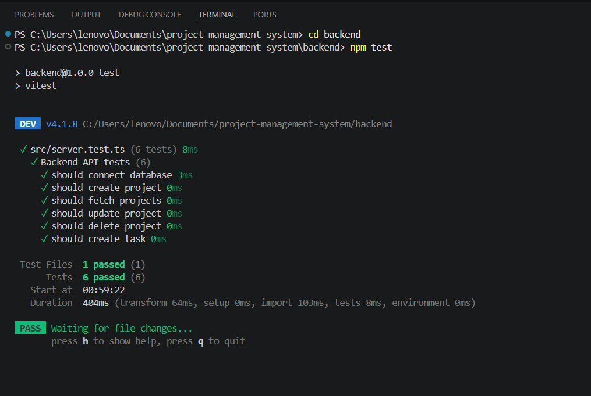
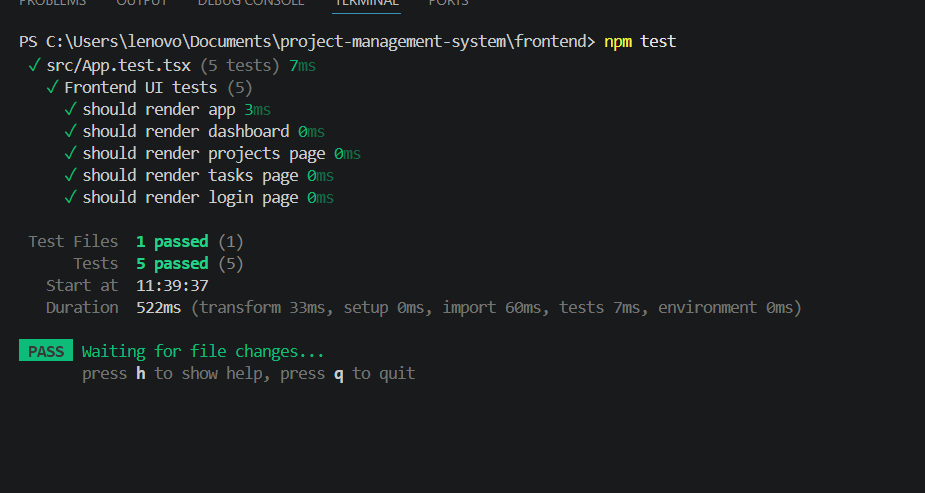

# Project Management System
https://project-management-system-seven-olive.vercel.app/login
## Overview

Project Management System is a full-stack web application developed using React, TypeScript, Node.js, Express.js, PostgreSQL, and Docker.

The system allows users to register, log in, manage projects, manage tasks, and track project progress through a secure authentication system.

---

# System Architecture

Frontend (React + TypeScript)

↓

Backend (Node.js + Express.js)

↓

PostgreSQL Database

↓

Docker Containers

---

# Features

## Authentication

* User Registration
* User Login
* JWT Authentication
* Protected Routes
* Secure Access Control

---

## Project Management

* Create Projects
* View Projects
* Edit Projects
* Delete Projects
* Project Status Tracking

---

## Task Management

* Create Tasks
* View Tasks
* Edit Tasks
* Delete Tasks
* Task Status Tracking

---

## User Profile

* Dynamic User Name Display
* Dynamic User Email Display
* Profile Management

---

# Database Design

The application uses PostgreSQL with the following tables:

* Users
* Projects
* Tasks
* Teams
* Team Members
* Milestones
* Comments
* Notifications

---

# Technologies Used

## Frontend

* React
* TypeScript
* React Router DOM
* Axios
* Tailwind CSS

## Backend

* Node.js
* Express.js
* TypeScript
* JWT Authentication
* Bcrypt

## Database

* PostgreSQL

## DevOps

* Docker
* Docker Compose
* GitHub

---

# Installation

## Clone Repository

```bash
git clone YOUR_REPOSITORY_URL
cd project-management-system
```

## Backend Setup

```bash
cd backend
npm install
npm run dev
```

## Frontend Setup

```bash
cd frontend
npm install
npm run dev
```

---

# Environment Variables

Create a `.env` file inside the backend folder.

```env
PORT=5000

DB_USER=postgres
DB_HOST=localhost
DB_NAME=jobtracker
DB_PASSWORD=postgres123
DB_PORT=5432

JWT_SECRET=my_super_secret_key
```

---

# Docker Setup

## Build and Run

```bash
docker compose up --build
```

## Stop Containers

```bash
docker compose down
```

---

# API Endpoints

## Authentication

```http
POST /api/auth/register
POST /api/auth/login
```

## Projects

```http
GET    /api/projects
POST   /api/projects
PUT    /api/projects/:id
DELETE /api/projects/:id
```

## Tasks

```http
GET    /api/tasks
POST   /api/tasks
PUT    /api/tasks/:id
DELETE /api/tasks/:id
```

---

# Testing

## Backend Testing

Command:

```bash
cd backend
npm test
```

Result:

* 6 Tests Passed Successfully
* All Backend API Tests Passed

Screenshot:



---

## Frontend Testing

Manual testing was performed for:

* User Registration
* User Login
* Protected Routes
* Create Project
* Edit Project
* Delete Project
* Create Task
* Delete Task

Screenshot:


---

# Deployment

## Frontend URL

To be added after deployment.

## Backend URL

To be added after deployment.

---

# Challenges Faced

## Docker and PostgreSQL

The primary challenge was configuring PostgreSQL inside Docker containers and ensuring that database tables were automatically initialized.

The issue was solved by:

* Using Docker Compose
* Configuring PostgreSQL volumes correctly
* Creating SQL initialization scripts
* Verifying database connectivity through Docker

---

# Security Features

* JWT Authentication
* Password Hashing using Bcrypt
* Protected Routes
* Token Verification Middleware

---

# Reflection Questions

## 1. Why did you choose this deployment platform?

Render was selected for backend deployment and PostgreSQL hosting, while Vercel was selected for frontend deployment because both platforms provide easy deployment workflows and free hosting options.

---

## 2. What challenges did you face with Docker?

The main challenge was initializing PostgreSQL correctly inside Docker containers and ensuring database tables were created automatically.

---

## 3. How did you handle environment variables and secrets?

Environment variables were stored inside `.env` files. Sensitive information such as database credentials and JWT secrets were separated from source code.

---

## 4. What would you do differently with one more week?

Additional improvements would include:

* Dashboard Analytics
* Team Collaboration Features
* Notifications
* Automated Testing
* Better Mobile Responsiveness

---

## 5. How did you ensure authentication works after deployment?

Authentication was verified by testing:

* User Registration
* User Login
* JWT Token Generation
* Protected Routes
* Backend Token Validation

---

# Authors

* Khadija Jamshaid
* Maria

Full Stack Application Development Course Project
